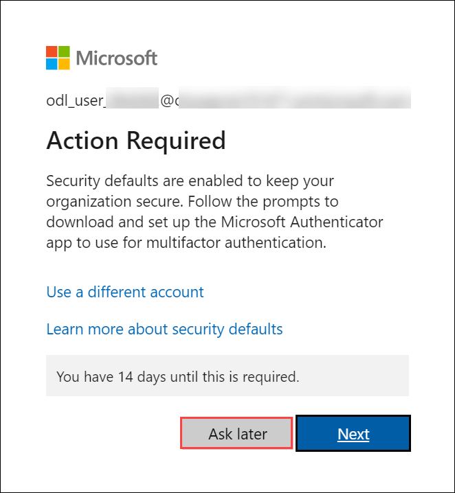
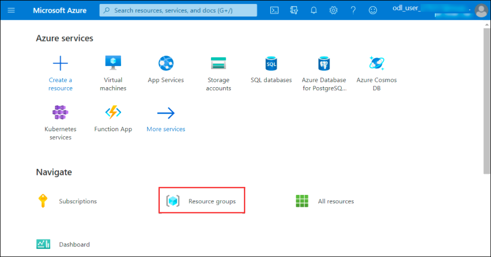

# Microsoft Defender for Cloud Workshop

### Overall Estimated Duration: 8 Hours

## Overview

This lab provides hands-on experience in enhancing cloud security using Microsoft Defender for Cloud. You'll enable Defender for Cloud, assess coverage, and configure data collection for optimal security monitoring. You'll navigate the dashboard, understand pricing, explore the Secure Score and recommendations, delve into Security Controls, and manage assets using the Inventory capability. Additionally, you'll generate custom queries to identify entry points, utilize reports, and implement governance rules to assign accountability and track progress. This lab helps you ensure a strong security posture for your cloud environment by continuously assessing workloads and providing actionable recommendations.

## Objective

Enable Microsoft Defender for Cloud, configure settings, and explore key features to enhance security and monitoring. Use the Ransomware Dashboard and governance rules to assess risks and ensure compliance. By the end of this lab, you will be able to:

- **Preparing the Environment**: By enabling Microsoft Defender for Cloud, assessing coverage status across subscriptions and workspaces, and configuring data collection settings, you will enhance your security monitoring and ensure comprehensive protection for your cloud environment.
- **Exploring Microsoft Defender for Cloud**: Gain a comprehensive understanding of Microsoft Defender for Cloud by exploring its Dashboard, Secure Score, and Security Controls. You'll review the Inventory capability and understand the pricing model, equipping you with the knowledge to enhance cloud security and manage costs effectively.
- **Understanding your Cloud Attack Surface**: Identify likely points of entry for potential security threats and then build and explore custom risk scenarios tailored to your environment. This hands-on approach will enhance your ability to proactively address vulnerabilities and strengthen your security posture.
- **Dashboards**: Utilize the Ransomware Dashboard to gain insights into potential threats, assess the coverage of your attack surface to ensure comprehensive protection, and deploy community workbooks to enhance monitoring and response capabilities.
- **Governance Rule**: Assign a governance rule to enforce organizational policies and ensure compliance across your cloud environment.
- **Data Security Posture Management (Read Only)**: Gain an understanding of Microsoft Data Security Posture Management, focusing on its role in safeguarding data across your cloud environment

## Pre-requisites

- Familiarity with cloud security concepts
- Basic knowledge of Governance and Compliance practices

## Architecture

This lab offers a hands-on experience in enhancing cloud security with Microsoft Defender for Cloud. You'll enable Defender, assess coverage across subscriptions and workspaces, and configure data collection for optimal security monitoring. By navigating the Defender Dashboard, you'll explore pricing, the Secure Score, Security Controls, and Inventory capabilities. Your task is to improve the cloud environment's security posture, monitor metrics, understand costs, and apply recommendations to boost your Secure Score. Additionally, you'll create custom queries to hunt for entry points, use specialized reports, and implement governance rules for accountability. Microsoft Defender for Cloud continuously assesses workloads, providing recommendations to harden assets, gain visibility across multi-cloud and hybrid environments, identify risks, and remediate vulnerabilities.

## Explanation of Components

- **Microsoft Defender for Cloud**: Provides comprehensive security management and threat protection for cloud resources, enhancing visibility and control across your environment.

- **Storage Account**: A scalable solution in Azure for storing and managing data, including blobs, files, queues, and tables.

- **Log Analytics Workspace**: Centralizes log data collection and analysis from various Azure resources and on-premises systems, enabling advanced monitoring and insights.

- **Virtual Machine**: A scalable computing resource in Azure that runs virtualized operating systems, providing flexible and on-demand compute power.

# Getting Started with Lab

1. Once the environment is provisioned, a virtual machine (LabVM) and lab guide will get loaded in your browser. Use this virtual machine throughout the workshop to perform the lab. You can see the number on the lab guide bottom area to switch to different exercises of the lab guide.
   
   

1. To get the lab environment details, you can select the **Environment Details** tab. Additionally, the credentials will also be emailed to your email address provided during registration. You can also open the Lab Guide on a separate and full window by selecting the **Split Window** from the lower right corner. Also, you can start, stop, and restart virtual machines from the **Resources** tab.

   
 
1. Verify all the Virtual Machines are running. If not, please click on the **Start** action button in the **Resources** tab.

   

## Login to Azure Portal

1. In the JumpVM, click on the Azure portal shortcut of the Microsoft Edge browser from the desktop.

   
   
1. On the **Sign in to Microsoft Azure** tab you will see a login screen, enter the following email/username and then click on **Next**. 
   * Email/Username: **<inject key="AzureAdUserEmail" enableCopy="true"/>** 
   
     
     
1. Now enter the following password and click on **Sign in**.
   * Password: **<inject key="AzureAdUserPassword" enableCopy="true"/>**
   
     
     
1. On **Action Required** pop-up, click on **Ask later**.

     

1. If you see the pop-up **Stay Signed in?**, click **No**.

1. If you see the pop-up **You have free Azure Advisor recommendations!**, close the window to continue the lab.

1. If a **Welcome to Microsoft Azure** popup window appears, click **Maybe Later** to skip the tour.
   
1. Now you will see the Azure Portal Dashboard, click on **Resource groups** from the Navigate panel to see the resource groups.

   
   
1. Confirm you have resource groups present as shown in the below screenshot.

   
   
1. Now, click on Next from the lower right corner to move to the next page.

## Support Contact

The CloudLabs support team is available 24/7, 365 days a year, via email and live chat to ensure seamless assistance at any time. We offer dedicated support channels tailored specifically for both learners and instructors, ensuring that all your needs are promptly and efficiently addressed.

Learner Support Contacts:

- Email Support: labs-support@spektrasystems.com
- Live Chat Support: https://cloudlabs.ai/labs-support

  Now, click on Next from the lower right corner to move on to the next page.

## Happy Learning!!
