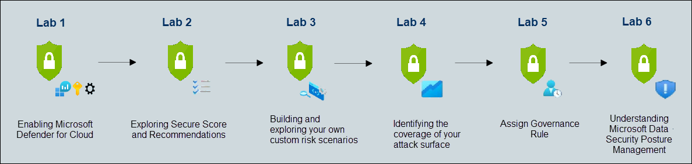

# Microsoft Defender for Cloud Workshop

### Overall Estimated Duration: 8 Hours

## Overview

[Microsoft Defender for Cloud (MDC)](https://learn.microsoft.com/en-us/azure/defender-for-cloud/defender-for-cloud-introduction) provides: 

* A development security operations (DevSecOps) solution that unifies security management at the code level across multi-cloud and multiple-pipeline environments
* A cloud security posture management (CSPM) solution that surfaces actions that you can take to prevent breaches
* A cloud workload protection platform (CWPP) with specific protections for servers, containers, storage, databases, and other workloads

This lab provides hands-on experience in enhancing cloud security using Microsoft Defender for Cloud. You'll enable Defender for Cloud, assess coverage, and configure data collection for optimal security monitoring. You'll navigate the dashboard, understand pricing, explore the Secure Score and recommendations, delve into Security Controls, and manage assets using the Inventory capability. Additionally, you'll generate custom queries to identify entry points, utilize reports, and implement governance rules to assign accountability and track progress. This lab helps you ensure a strong security posture for your cloud environment by continuously assessing workloads and providing actionable recommendations.

## Objective

Enable Microsoft Defender for Cloud, configure settings, and explore key features to enhance security and monitoring. Use the Ransomware Dashboard and governance rules to assess risks and ensure compliance. By the end of this lab, you will be able to:

- **Preparing the Environment**: By enabling Microsoft Defender for Cloud, assessing coverage status across subscriptions and workspaces, and configuring data collection settings, you will enhance your security monitoring and ensure comprehensive protection for your cloud environment.
- **Exploring Microsoft Defender for Cloud**: Gain a comprehensive understanding of Microsoft Defender for Cloud by exploring its Dashboard, Secure Score, and Security Controls. You'll review the Inventory capability and understand the pricing model, equipping you with the knowledge to enhance cloud security and manage costs effectively.
- **Understanding your Cloud Attack Surface**: Identify likely points of entry for potential security threats and then build and explore custom risk scenarios tailored to your environment. This hands-on approach will enhance your ability to proactively address vulnerabilities and strengthen your security posture.
- **Dashboards**: Utilize the Ransomware Dashboard to gain insights into potential threats, assess the coverage of your attack surface to ensure comprehensive protection, and deploy community workbooks to enhance monitoring and response capabilities.
- **Governance Rule**: Assign a governance rule to enforce organizational policies and ensure compliance across your cloud environment.
- **Data Security Posture Management (Read Only)**: Gain an understanding of Microsoft Data Security Posture Management, focusing on its role in safeguarding data across your cloud environment

## Pre-requisites

Participants should have:

- Familiarity with cloud security concepts
- Basic knowledge of Governance and Compliance practices

## Architecture

This lab offers a hands-on experience in enhancing cloud security with Microsoft Defender for Cloud. You'll enable Defender, assess coverage across subscriptions and workspaces, and configure data collection for optimal security monitoring. By navigating the Defender Dashboard, you'll explore pricing, the Secure Score, Security Controls, and Inventory capabilities. Your task is to improve the cloud environment's security posture, monitor metrics, understand costs, and apply recommendations to boost your Secure Score. Additionally, you'll create custom queries to hunt for entry points, use specialized reports, and implement governance rules for accountability. Microsoft Defender for Cloud continuously assesses workloads, providing recommendations to harden assets, gain visibility across multi-cloud and hybrid environments, identify risks, and remediate vulnerabilities.

## Architecture Diagram

  

## Explanation of Components

The architecture for this lab involves the following key components:

- **Microsoft Defender for Cloud**: Provides comprehensive security management and threat protection for cloud resources, enhancing visibility and control across your environment.
- **Storage Account**: A scalable solution in Azure for storing and managing data, including blobs, files, queues, and tables.
- **Log Analytics Workspace**: Centralizes log data collection and analysis from various Azure resources and on-premises systems, enabling advanced monitoring and insights.
- **Virtual Machine**: A scalable computing resource in Azure that runs virtualized operating systems, providing flexible and on-demand compute power.

## Getting Started with the Lab
 
Welcome to your Microsoft Defender for Cloud Workshop Workshop! We've prepared a seamless environment for you to explore and learn about Azure services. Let's begin by making the most of this experience:
 
## Accessing Your Lab Environment
 
Once you're ready to dive in, your virtual machine and lab guide will be right at your fingertips within your web browser.

### Virtual Machine & Lab Guide
 
Your virtual machine is your workhorse throughout the workshop. The lab guide is your roadmap to success.
 
## Exploring Your Lab Resources
 
To get a better understanding of your lab resources and credentials, navigate to the **Environment** tab.
 

 
## Utilizing the Split Window Feature
 
For convenience, you can open the lab guide in a separate window by selecting the **Split Window** button from the Top right corner.
 

 
## Managing Your Virtual Machine
 
Feel free to start, stop, or restart your virtual machine as needed from the **Resources** tab. Your experience is in your hands!

## Login to Azure Portal

1. In the JumpVM, click on the Azure portal shortcut of the Microsoft Edge browser from the desktop.

   
   
1. On the **Sign in to Microsoft Azure** tab you will see a login screen, enter the following email/username and then click on **Next**. 
   * Email/Username: **<inject key="AzureAdUserEmail" enableCopy="true"/>** 
   
     
     
1. Now enter the following password and click on **Sign in**.
   * Password: **<inject key="AzureAdUserPassword" enableCopy="true"/>**
   
     
     
1. On **Action Required** pop-up, click on **Next**.

     

1. In the Keep your account secure window, The window that appears and the steps that follow are for the Microsoft Authenticator app method. Select **Next**.

   

    >**NOTE:** If you dont have the Microsoft Authenticator app installed on your mobile device , select **Download** now and follow the steps.

1. On the Set up your account page opens, select **Next.**

   

1. Scan the QR code through your phone. On the phone, inside the Authenticator app select Work or school account, and scan the QR code. Select **Next**.

   

1. On the Keep your account secure page. Enter the code, which is shown on the Authenticator app.

   

1. Once the code is entered. click **Next**

   

1. Select Done, on the Success! page.

    

1. If you see the pop-up **Stay Signed in?**, click **No**.

1. If you see the pop-up **You have free Azure Advisor recommendations!**, close the window to continue the lab.

1. If a **Welcome to Microsoft Azure** popup window appears, click **Cancel** to skip the tour.
   
1. Now you will see the Azure Portal Dashboard, click on **Resource groups** from the Navigate panel to see the resource groups.

   
   
1. Confirm you have resource groups present as shown in the below screenshot.

   
   
1. Now, click on Next from the lower right corner to move to the next page.

## Support Contact

The CloudLabs support team is available 24/7, 365 days a year, via email and live chat to ensure seamless assistance at any time. We offer dedicated support channels tailored specifically for both learners and instructors, ensuring that all your needs are promptly and efficiently addressed.

Learner Support Contacts:

- Email Support: cloudlabs-support@spektrasystems.com
- Live Chat Support: https://cloudlabs.ai/labs-support

Now, click on Next from the lower right corner to move on to the next page.

### Happy Learning!!
