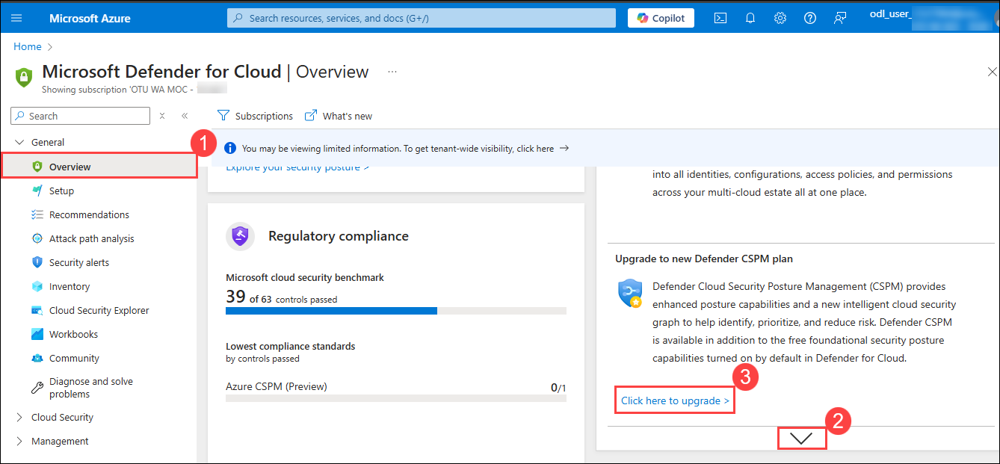
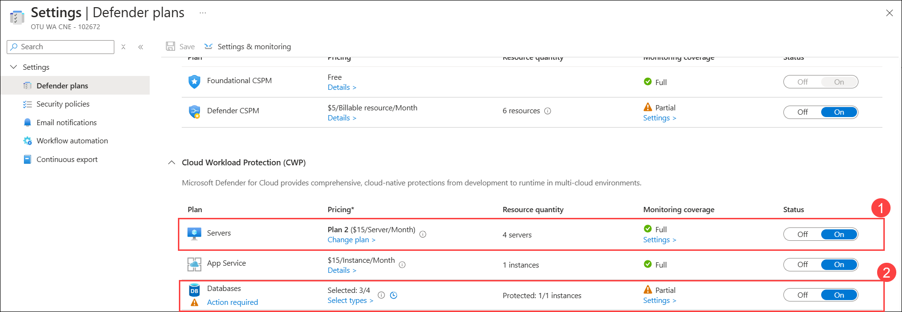
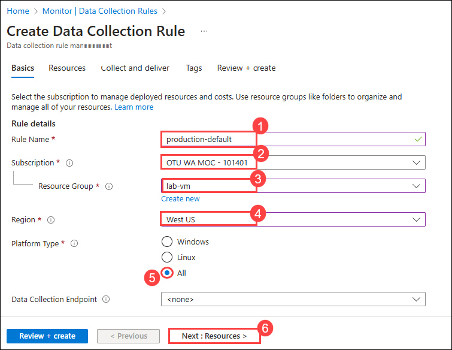

# Lab 01: Preparing the Environment

### Estimated Duration: 30 minutes

## Lab Scenario

You are a cloud security administrator tasked with securing your organization's Azure environment. This lab provides a hands-on experience in enhancing cloud security using Microsoft Defender for Cloud. You will enable Microsoft Defender for Cloud, assess the status of Defender coverage across their subscription and workspace, and configure data collection settings to optimize security monitoring. This lab ensures that you can effectively manage and secure your cloud environments.

## Lab Objectives
In this lab, you will complete the following tasks:

- Task 1: Enabling Microsoft Defender for Cloud (Read-Only)
- Task 2: Get the status of the Defender coverage on the subscription and the workspace
- Task 3: Configure the data collection settings in Microsoft Defender for Cloud (Read Only)

### Task 1: Enabling Microsoft Defender for Cloud (Read-Only)

1. In the search bar, type **Microsoft Defender (1)** and select **Microsoft Defender for Cloud (2)** from the results.

      

2. On the **Overview (1)** page, Click on **Down arrow (2)** to Scroll down and find for **Upgrade to new Defender CSPM plan** and select **Click here to upgrade (3)**

   

1. You will be redirected to the **Getting started** page , now select the **Workspace name (1)**. Click on **Upgrade (2)**.

   

   >**Note:** The upgrade may take a few minutes to complete, so please wait for a moment.

### Task 2: Get the status of the Defender coverage on the subscription and the workspace

1. Go back to the Microsoft Defender for Cloud blade and click on **Environment settings (1)** under **Management**. Expand **Azure (2)** to reveal the **Tenant Root Group**, then expand **Tenant Root Group (3)** to display the **Subscription**. Next, expand **Subscription (4)** to show the **Workspace**. You’ll notice that the Defender coverage is **11/13 plans (5)** for the subscription and **2/2 plans (5)** for the workspace, indicating that your environment is now fully protected with Microsoft Defender for Cloud.

   

2. In the **Environment settings**, click on **Subscription** and observe how the Microsoft Defender for Cloud plans are enabled.

   

1. Ensure that plans for **Servers (1)** and **Databases (2)** are turned **On**.

   

1. If the database plan is not enabled, click on **Database (1)** to view the **SQL servers on machines**. Then, under the databases section, click on **Select types (2)** and ensure that both **Azure SQL Databases (3)** and **SQL servers on machines (4)** are toggled **On**.

   

### Task 3: Configure Data Collection Settings Using Azure Monitor Agent (AMA) (Read Only)

1. In the search bar, type **Monitor (1)** and select **Monitor (2)** from the search results.

   

1. On the Monitor menu in the Azure portal under **Settings (1)**, select **Data Collection Rules (2)**  > **Create(3)** to open the DCR creation page.

   

1. On the Basic page, fill in the following fields with the appropriate values, then click on the **Resources (6)** tab:

   - **Rule Name:** Enter **Production-default (1)**
   - **Subscription:** Select the subscription from the drop-down menu **(2)**
   - **Resource group:** Choose the resource group named **lab-vm (3)**
   - **Region:** Enter **West US (4)**
   - **Platform Type:** Click on **All (5)**
  
     

1. The Resources page allows you to add VMs to be associated with the DCR. Select **+ Add resources** to select resources.

   

1. Under Subscription, expand Resource Groups and select the Virtual Machines that needs to be associated with Data Collection Rules and click on **Apply.** 

   

1. On the **Collect and deliver page (1)** click on **Add data source (2)** which allows you to add and configure data sources for the DCR and a destination for each.

   

1. On the **Data Source** Pane, Select a Data source type as **Windows Event Logs (1)** , choose **Basic (2)**, and then check all the fields **(3)** under Application, security , System and click on **Next: Destination (4)**.

   

1. On the **Destination** Pane, Add one or more destinations for each data source. select **Azure Monitor Logs (1)** for destination type , choose the **Subscription (2)** from the drop-down, select your **Workspace (3)** from the destination details and then click on **Save (4)**

   

1. Review the settings on the **Review + Create** page to ensure that all configurations for the Data Collection Rule (DCR), including resources, data sources, and destinations, are accurate. Once confirmed, click **Create** to finalize the setup.

   

   >**Note:** Creating the DCR establishes a connection between the specified data sources and destinations. This ensures that the configured VMs automatically send the selected data (e.g., Windows Event Logs) to the specified Azure Monitor Logs workspace, facilitating centralized monitoring and analysis.

 ## Summary

In this lab, you have enabled Microsoft Defender for Cloud, received the status of the Defender coverage on the subscription and the workspace and configured the data collection settings in Microsoft Defender for Cloud.
 
 ### You have successfully completed the lab
