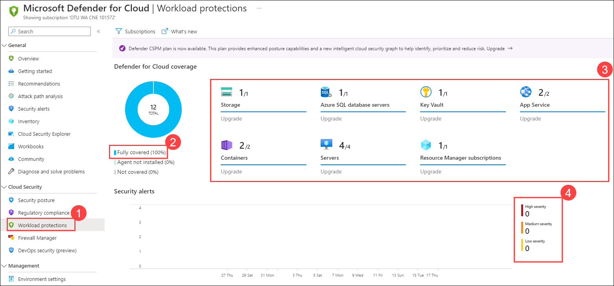
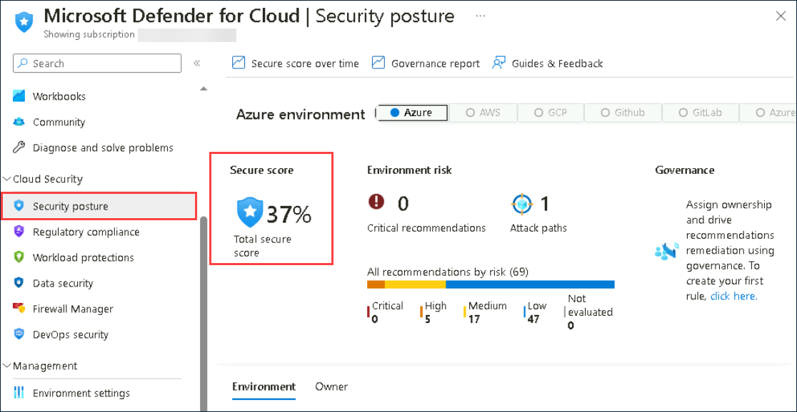
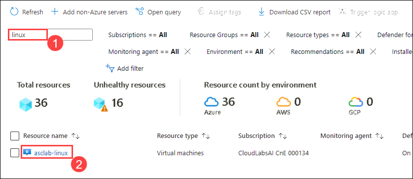
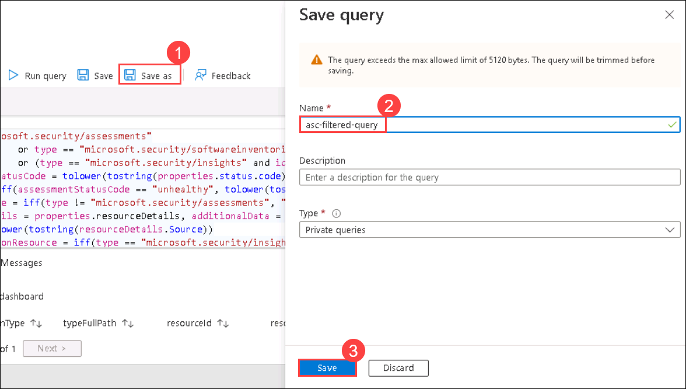
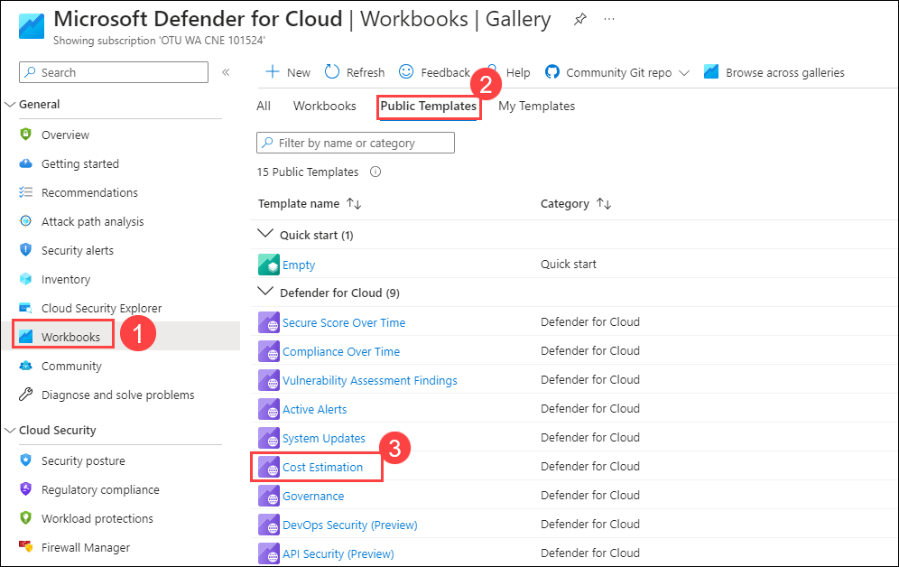
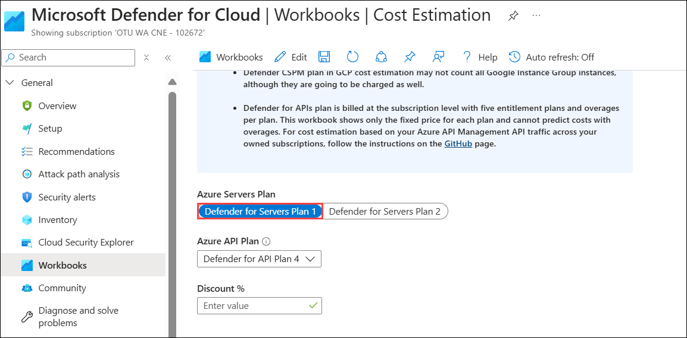

# Lab 02: Exploring Microsoft Defender for Cloud

### Estimated Duration: 1 hours

## Lab Scenario

In this lab, you will learn to navigate the Microsoft Defender for Cloud Dashboard, understand its pricing model, explore the Secure Score and its associated recommendations, delve into Security Controls, and examine the Inventory capability. Imagine you are a security analyst at a mid-sized company migrating its infrastructure to Azure. Your task is to ensure the security posture of the cloud environment using Microsoft Defender for Cloud. You'll monitor security metrics, understand costs, apply recommendations to improve your Secure Score, explore security controls to safeguard resources, and manage assets using the Inventory capability.

## Lab objectives

In this lab, you will complete the following tasks:

- Task 1: Understanding Microsoft Defender for Cloud Dashboard
- Task 2: Exploring Secure Score and Recommendations
- Task 3: Exploring Security Controls and Recommendations (Read-Only)
- Task 4: Exploring the Inventory capability
- Task 5: Understanding pricing
- Task 6: Overview of CWP capabilities (Read Only)

### Task 1: Understanding Microsoft Defender for Cloud Dashboard 

1. In the search bar, type **Microsoft Defender (1)** and select **Microsoft Defender for Cloud (2)** from the results.

       

2. On the **Overview (1)** blade notes that it now provides a unified view into the security posture and includes multiple independent cloud security pillars such as **Security posture, Regulatory compliance, Workload protections, Firewall Manager, Inventory, and Information Protection (preview) (2)**. Each of these pillars also has its dedicated dashboard allowing deeper insights and actions around that vertical, providing easy access and better visibility for security professionals.

   > **Info**: Microsoft Defender for Cloud takes time to populate information such as secure score, compliance, recommendations, etc. after enabling the services and enrolling the servers in Microsoft Defender for Cloud.
 
     

3. Note that the **top menu** bar allows you to view and filter subscriptions by selecting the **Subscriptions** button. In this lab, we will use only one but selecting different/additional subscriptions will adjust the interface to reflect the security posture of the selected subscriptions.

     

4. Click on the **What’s new** button – a new tab opens with the latest release notes where you can stay current on the new features, bug fixes, and more.

      
	
5. Note the **high-level numbers** at the top menu; This view allows you to see a summary of your subscriptions, active recommendations, and security alerts alongside connected cloud accounts.

     

6. From the top menu bar, click on **Azure subscriptions**.
	
    

    - This will bring you into the environment settings. Then select the available subscription. 

      

7. On the **Defender plans** page, note that your subscription is fully covered – which means that your subscription is covered by Microsoft Defender for Cloud. 	

   

   > **Info**: This page shows a list of subscriptions and their coverage type. You can use this page to find subscriptions that are not covered by Microsoft Defender for Cloud and help you identify “shadow IT” subscriptions.

8. Go back to the **Overview** page, and look at the **Security posture** tile, you can see your current score along with the number of completed controls and recommendations. Clicking on this tile will redirect you to a drill-down view across subscriptions.

   

   > **Info**: The higher the score, the lower the identified risk level.

9. On the **Regulatory Compliance (1)** tile, you can get insights into your compliance posture based on continuous assessment of both Azure and hybrid cloud environments. This tile shows the following standards which are **Microsoft Cloud Security benchmark (2)**, and **Lowest compliance regulatory standard (3)** to view the data we first need to add **Security policies**. 
 
    >**Note:** Clicking on this tile will take you to the Regulatory Compliance dashboard, where you can add new standards and explore the existing ones.

    
   
10. Navigate to **Environment settings (1)**, select the available **Subscription (2)**. 

    

11. From the **Environment settings** page navigate on **Security policies (1)**. In the search bar, search for **ISO 27001:2013 (2)**. Click on the toggle button to change the status to **On (3)**.

    
     
12. Now on the **Security policies (1)** page, In the search bar, search for **SOC 2 Type 2 (2)**. Click on the toggle button to change the status to **On (3)**.

     

13. On the **Set parameters** blade, enter the following details and click on **Save (4)**.

   - Allowed registry or registries regex: **[] (1)**
   - Max allowed CPU units: **200m (2)**
   - Max allowed memory bytes: **1 (3)** 

      

14. Navigate back to **Regulatory Compliance** to view the recently added standards click on **Show all**.

    

    > **Note**:It may take up to two hours for newly added standards to appear under the **Lowest compliance regulatory standard**. Please proceed to the next step, and you can review the standards later.

15. On the **Workload Protections** **(1)**, under Cloud Security, Your current resource coverage should be **fully covered 100% (2)** which means **full protection**, you can see the coverage of your **connected resources (3)** for the currently selected subscription. Additionally, you can also view the recent **security alerts (4)**, color-coded by severity.

    

16. Next, click on **Inventory** from the General section of Microsoft Defender for Cloud. It displays the total resources and highlights any unhealthy resources. Resources are classified according to their health status, helping you identify any issues that require attention.

       

### Task 2: Exploring Secure Score and Recommendations 

Previously, we briefly explored the Secure Score tile on the overview page. Now let’s dive into this capability and the associated recommendations. Microsoft Defender for Cloud continually assesses your resources. All findings are aggregated into a single score (Secure Score), which measures the current security posture of your subscription; the higher the score, the lower the identified risk level.

1. In the **Microsoft Defender for Cloud Overview blade**. From the left navigation pane, under the **Cloud Security** section, click on the **Security posture** button.

     

2. On the Secure score page, **review your current overall secure score percentage**.

    

   > **Note**: Your score is shown as a percentage value, but you can also see the number of points on which the score is being calculated based on. 

   > For more information on how the score is calculated, [refer to the secure score documentation page](https://docs.microsoft.com/en-us/azure/security-center/secure-score-security-controls#how-your-secure-score-is-calculated).

3. On the bottom part, you can see a list of subscriptions and their current score. To view the recommendations behind the score, click on **view recommendations**.

### Task 3: Exploring Security Controls and Recommendations (Read-Only)

1. On the **Recommendations (1)** page, select the **Switch to classic view (2)** now pay attention to the first part of the page; the **summary view** which includes the current score, progress on the recommendations (both completed security controls and recommendations) and resource health (by severity).

   

   

3. On the top menu, Click on the **Download CSV report** button – this allows you to get a snapshot of your resources, their health status, and the associated recommendations. You can use it for pivoting and reporting.
   
    

4. Under **Recommendation**, Click on **Manage access and permissions (1)** and select **Storage account public access should be disallowed (2)** from the drop down list.

    

   > **Note:** You should switch to the classic view for **Recommendations**.

5. On the top section, notice the following:

   - Title of the recommendation: **Storage account public access should be disallowed (1)**
   - Top menu controls: **Exempt**, **Deny**, **View policy definition** and **Open query** **(2)**
   - Severity indicator: **Medium (3)**
   - Freshness interval: **30 Min (4)** 
   - Tactics and techniques: **Initial Access (5)**

     

6. The next important part is the **Remediation Steps** which contains the remediation logic where you can remediate the selected resource/s.

7. Under **Affected resources (1)**, **select a resource** (the single **storage account (2)** on the Unhealthy resources) and click on **Fix (3)**. This will automatically apply the remediation on the selected resource.

     
  
11. This will open a new window - **Fixing resources**, review the implications for this remediation and click on **Fix 1 resource**.

     
  
12. Wait for a notification: ✅ **Remediation successful** - Successfully remediated the issues on the selected resources. 
    
    > **Note**: It can take several minutes after remediation completes to see the resources in the 'healthy resources' tab. You can move to the next task and come back later to check on this.

    > **Info**: In the recommendation list, you can now see some recommendations flagged as in the preview. They aren’t included in the calculation of your score. They should be still remediated so that when the preview period ends, they will contribute towards your final score.

### Task 4: Exploring the Inventory capability

Asset inventory dashboard allows you to get a single pane of glass view of all your resources covered by Microsoft Defender for Cloud. It also provides per-resource visibility to all Microsoft Defender for Cloud’s information and additional resource details including security posture and protection status. Since this dashboard is based on Azure Resource Graph (ARG), you can run queries across subscriptions at a large scale, quickly and easily.

1. In the search bar, type **Microsoft Defender (1)** and select **Microsoft Defender for Cloud (2)** from the results.

       

1. From the left navigation pane, under the **General** section, click the **Inventory** button.

    
    
2. Hover your cursor over the **Summaries strip** at the top of the page.

   

   >**Note**: In your environment, these numbers may not be the same, since it varies in time

3. Notice the total number of resources, The total number of resources are the ones that are connected to the Microsoft Defender for Cloud and NOT the total number of resources that you have in your subscriptions.

4. Notice the number of **unhealthy resources**, The unhealthy resources are the resources with actionable recommendations based on the selected filter.

6. Use the **Filter by name** box to search for **linux** **(1)**. You should now see a filtered view containing your desired resource: **asclab-linux**. Hover on the red bar in the **recommendations** column to see a tooltip with the **active recommendations (2)**. You should expect to see **Active-xx of xx Recommendations** – these are the active recommendations you must attend.

    

7. Open the resource health pane by selecting the resource. Click on **asclab-linux**.

    

8. On the resource health pane for **asclab-linux**, review the virtual machine information alongside the recommendation list.

    

    > **Note**: It could take up to 24 hours for all the recommendations to show up. And it is possible that during lab time, this may not show up – which is the case sometimes. If you don't see the data in **recommendations**. You can continue to the next exercise and verify this later.

9. Navigate back to the Inventory page and clear the search keyword **Linux**. Then from the filter menu, select the **Resource Groups** filter and from the drop-down menu of **value** select **asclab-aks (1)** (Unselect remaining), and click on **Apply (2)**. Using this filter, you can see all resources related to the predefined Kubernetes resources which are monitored with active recommendations.

     

    > **Note:** The list can be filtered and sorted.

10. From the filter menu, select the **Resource Group** filter and **select all** under the Value. Again from the **Add filter menu (1)**, select **Recommendations**, **uncheck** the **All** option under the Value, search for **Auditing on SQL Server should be enabled (2)** and then select the **Auditing on SQL Server should be enabled (3)** and click on **Apply (4)**. You can also use the search area within the filter to better find items across the list. When you are done exploring remember to clear your filter.

     
   
    > **Note**: If you don't see **Auditing on SQL Server should be enabled** in search results that means it is not loaded yet to recommendations and it could take up to 24 hours for all the recommendations to show up. It is possible that during lab time, this may not show up – which is the case sometimes. If you don't see the data in **Recommendations**, you can note down this step number then continue to the next exercise and verify this later.
   
11. From the filter pane, remove the **Resource type** filter then go to **Add filter** and notice the **Security findings** filter – it allows you to find all resources that are prone to a specific vulnerability. You can also search for CVE, KB ID, name, and missing update.

12. From the filter pane, remove the **Security findings** filter you added in the previous step then from the top menu, click on **Open query**.

    

13. On the **Azure Resource Graph Explorer** blade, click on **Run Query**. You should now have the same list of resources and columns as in the previous step. This query is editable for your needs and here it gets very powerful.
 
    

14. Save the query for later use by clicking on **Save as (1)** from the top menu. You can use it to create periodic reports. Name the report as **asc-filtered-query (2)** and select **Save (3)**.

    

### Task 5: Understanding pricing

The pricing criteria depend on the plan you enable. In addition, as a part of Foundational CSPM (free), you get several items like Secure Score, Asset Inventory, Security Recommendations, etc.

1. From **Microsoft Defender for Cloud**, click on **Workbooks (1)** select **Public Templates (2)** tab and click on **Cost Estimation (3)** 

    

2. In the **Cost Estimation** workbook, you can observe the estimated pricing for the resources in the Defender plans for Azure.

    

Refer to the following to learn more about Defender for cloud pricing:

 - [Pricing Page](https://azure.microsoft.com/en-us/pricing/details/defender-for-cloud/?v=17.23h)

 - [Foundational CSPM vs. Defender CSPM capabilities](https://learn.microsoft.com/en-us/azure/defender-for-cloud/concept-cloud-security-posture-management)
   
### Task 6: Overview of CWP capabilities  (Read Only) 

1. Navigate to **Workload protections** from the **Cloud Security** section of **Defender for Cloud** menu to view the **Workload Protections Dashboard**.

    

   ***The dashboard includes the following sections:***

	- **Defender for Cloud coverage (1)** - Here you can see the resource types that are in your subscription and eligible for protection by Defender for Cloud. Wherever relevant, you can upgrade here as well. If you want to upgrade all possible eligible resources, select Upgrade All.

	- **Security alerts (2)** - When Defender for Cloud detects a threat in any area of your environment, it generates an alert. These alerts describe details of the affected resources, suggested remediation steps, and in some cases an option to trigger a logic app in response. Selecting anywhere in this graph opens the Security Alerts page.

 	- **Advanced protection (3)** - Defender for Cloud includes many advanced threat protection capabilities for virtual machines, SQL databases, containers, web applications, your network, and more. In this advanced protection section, you can see the status of the resources in your selected subscriptions for each of these protections. Select any of them to go directly to the configuration area for that protection type.

	- **Insights (4)** - This rolling pane of news, suggested reading and high-priority alerts give Defender for Cloud insights into pressing security matters that are relevant to you and your subscription. Whether it's a list of high-severity CVEs discovered on your VMs by a vulnerability analysis tool, or a new blog post by a member of the Defender for Cloud team, you'll find it here in the Insights panel.

## Summary

In this lab, you have understaood Microsoft Defender for Cloud Dashboard and its pricing ,explored Secure Score and Recommendations , Security Controls and Recommendation and Inventory capability.

### You have successfully completed the lab
