# Lab 04: Dashboards

### Estimated Duration: 20 minutes

## Lab Overview

Other than the overall dashboard we discussed in Lab2, Microsoft Defender for Cloud provides several purpose-built reports, which are presented as workbooks.

## Lab Objectives

In this lab, you will complete the following tasks:

- Task 1: Ransomware Dashboard
- Task 2: Identifying the coverage of your attack surface
- Task 3: Deploying community workbooks

### Task 1: Ransomware Dashboard

1. From the available **Workbooks (1)**, select **Ransomware Dashboard (2)** under **Community**. The page shows the state of your current environment against various MITRE tactics used by ransomware.
   
   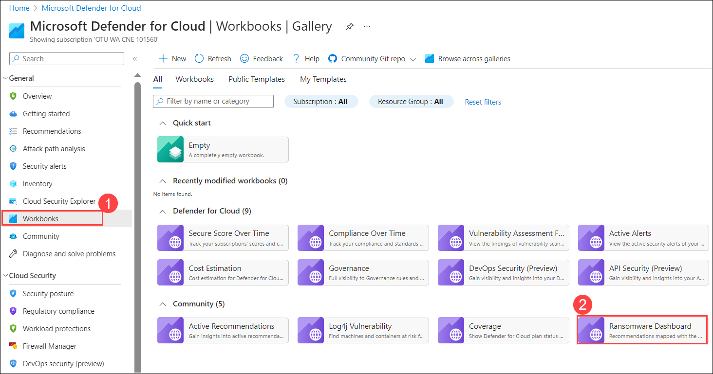

2. The Ransomware Dashboard is navigated.

   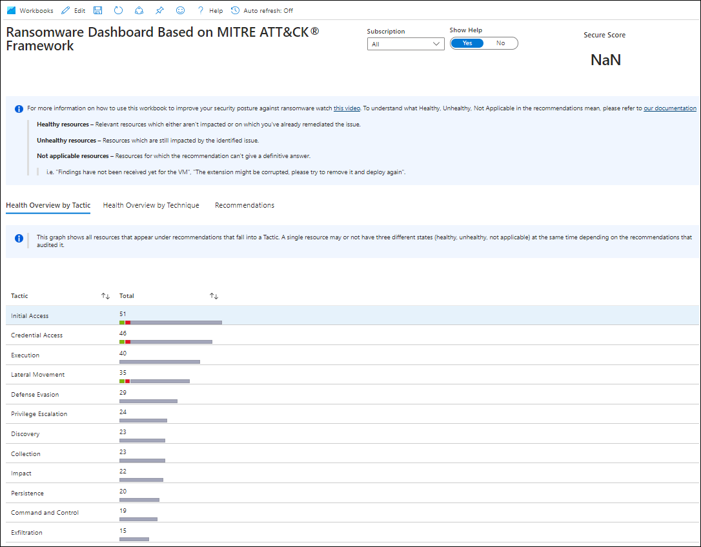

3. Select **Recommendations** to see technique-specific recommendations.

   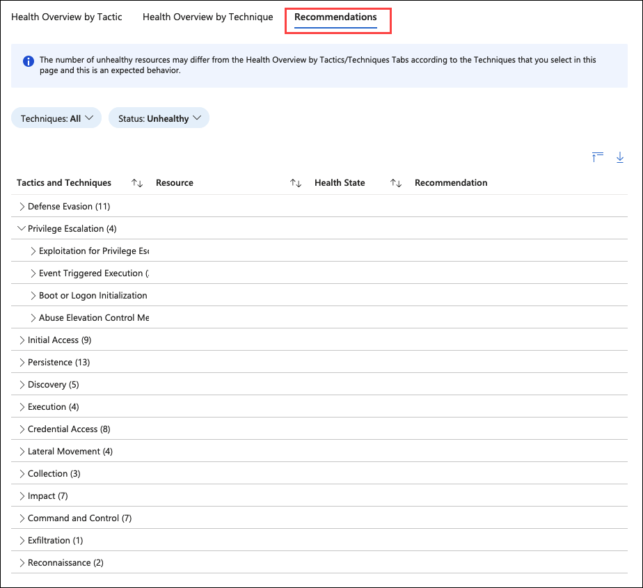

4. Select **Discovery (1)** and **Container and Resource(2)**.

   

5. You can filter the techniques. We will leave **All** selected.

   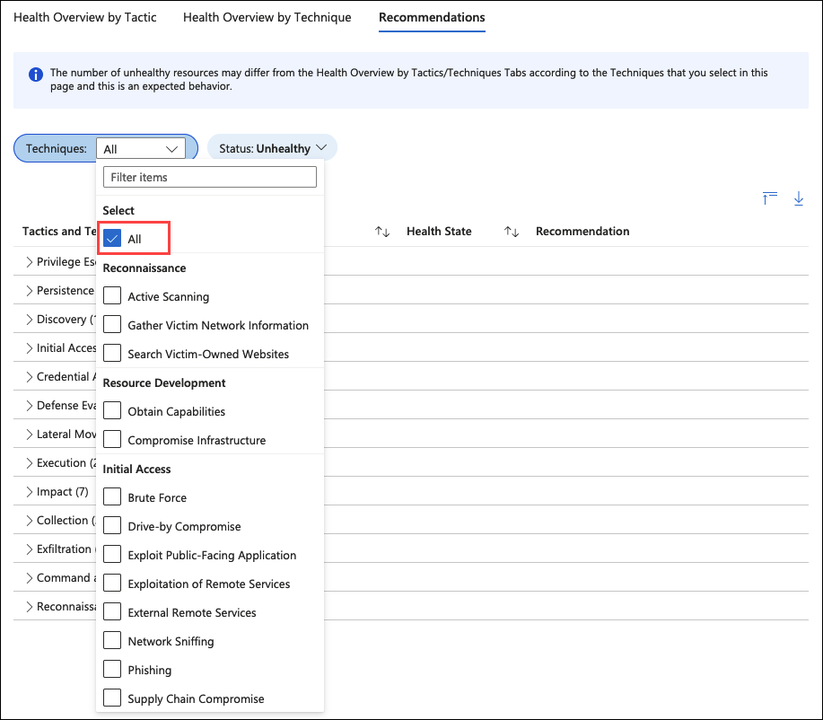

6. Click on expand grid **(1)**, next under the **Discover (2)** section, select **asclab-aks (3)**, and click the **Go to recommendation (4)** link.

   

7. You will be taken to the recommendation details that contain remediation steps and an option to fix.

   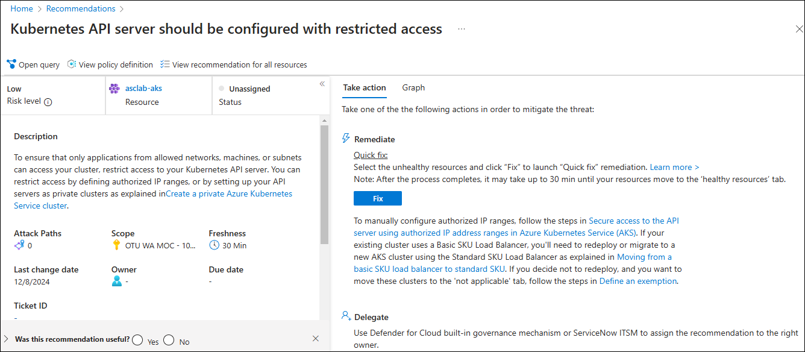

   >**Note:** While accessing AKS suggestions, you might encounter some Microsoft API issues. This is expected; please continue to the next step.

9. Close the workbook by clicking the **X** at the top right corner of the screen.

### Task 2: Identifying the coverage of your attack surface

1. Under **Workbooks (1)**, select the **Coverage (2)** workbook.

   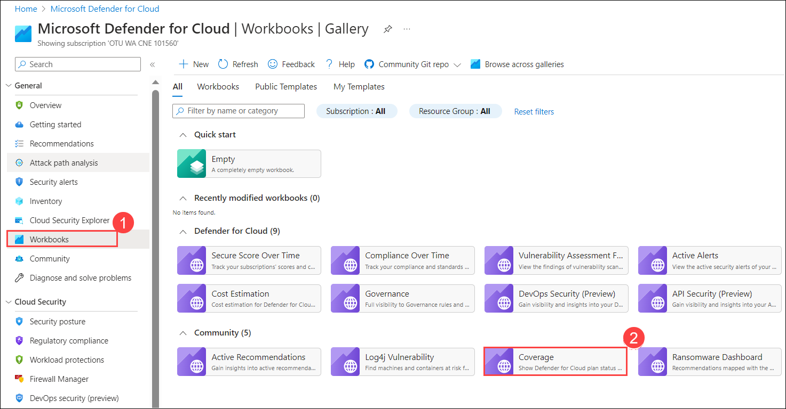

2. You can now see what Defender plans are enabled across different subscriptions.

   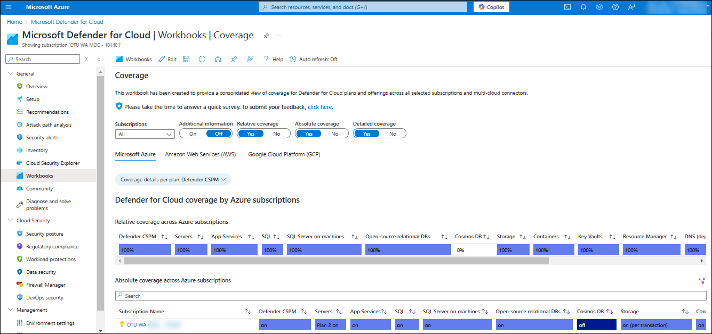

3. To select the settings of any plan for a given subscription, click the **on** or **off** corresponding to the plan.

   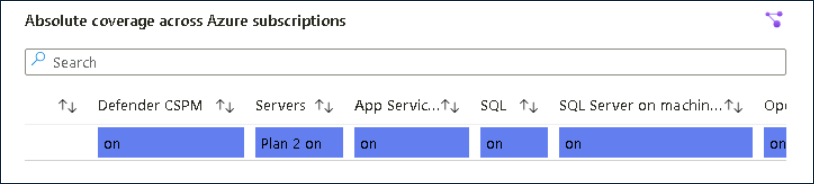

4. Now you can change the plan settings.

    

### Task 3: Deploying community workbooks

In addition to the workbooks available in the Azure Portal, you can also deploy several from the [MDC github](https://github.com/Azure/Microsoft-Defender-for-Cloud/tree/main/Workbooks)

1. From the **Workbooks (1)** blade, select the **Community Git repo > Microsoft Defender for Cloud (2)** under Community Git Repo.

   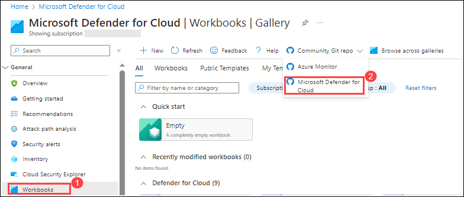

2. It will navigate to the **MDC Github** page. Scroll down to the bottom to select **WellArchitected Framework Security**.

   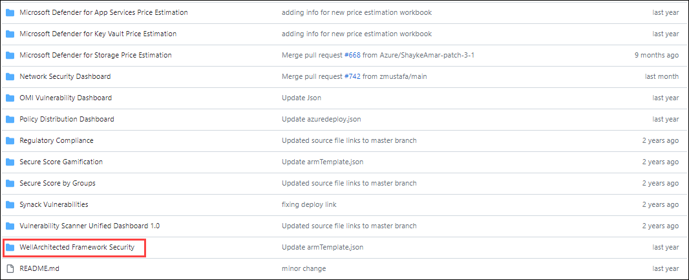

3. In the workbook, scroll down on the page until you see **Try it on the Azure Portal** and click the blue button **Deploy to Azure**.

   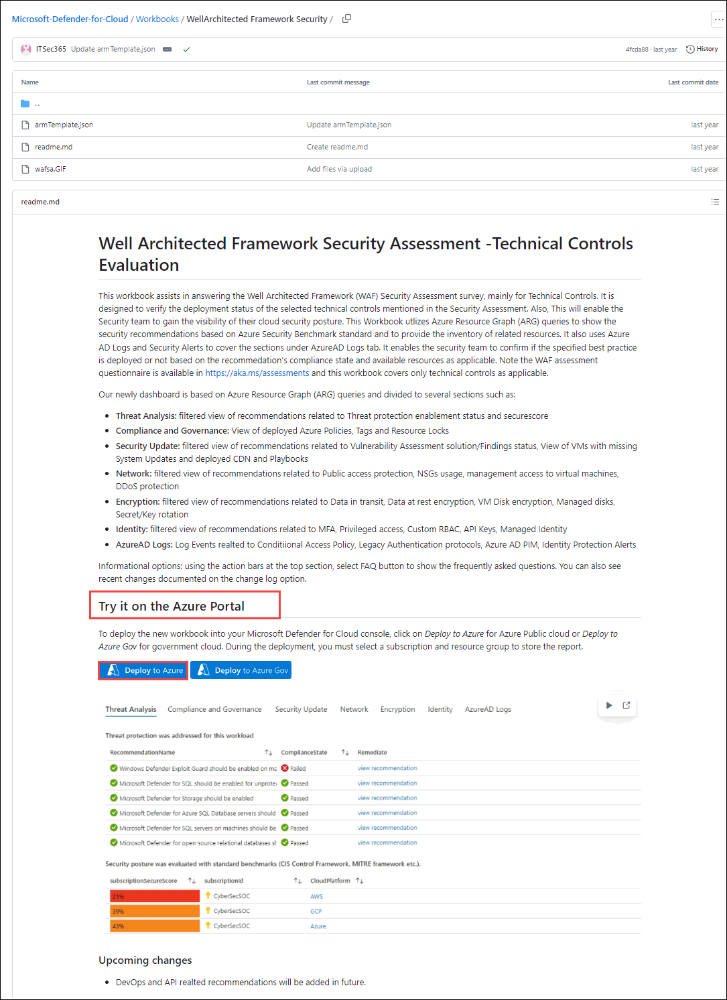

4. Choose the **subscription (1)** and select **asclab-WAF (2)** for **Resource Group** from the dropdown, leaving other settings unchanged. click the **Review + Create (3)** button at the bottom left corner. On the subsequent screen, click **Create**.

   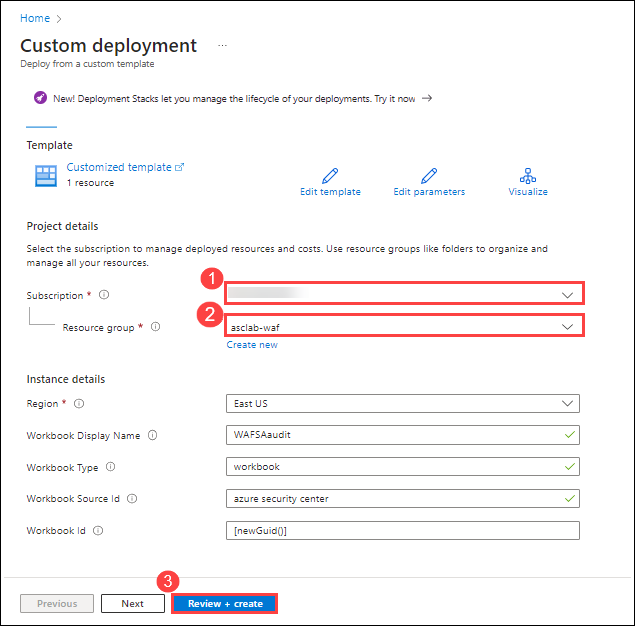

5. Once deployment is completed, select **Go to resource** from the screen.

   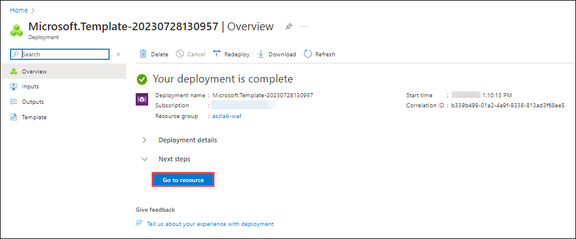

6. Click on **Open Workbook**.
   
   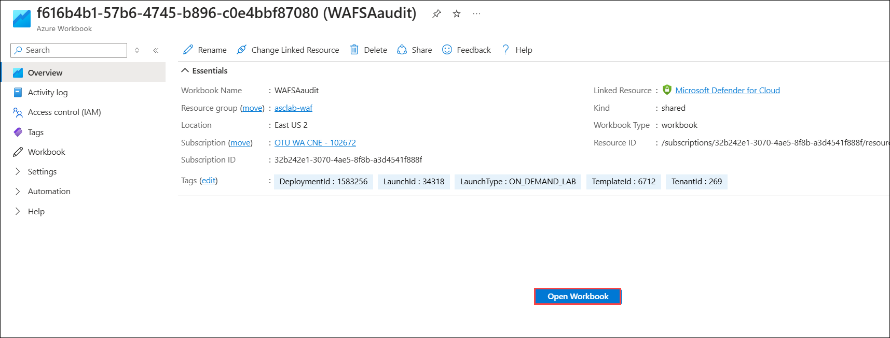

7. Now you will see the workbook, choose the **Subscription Name** to see how that subscription scores against **Well Architected Practices**.

   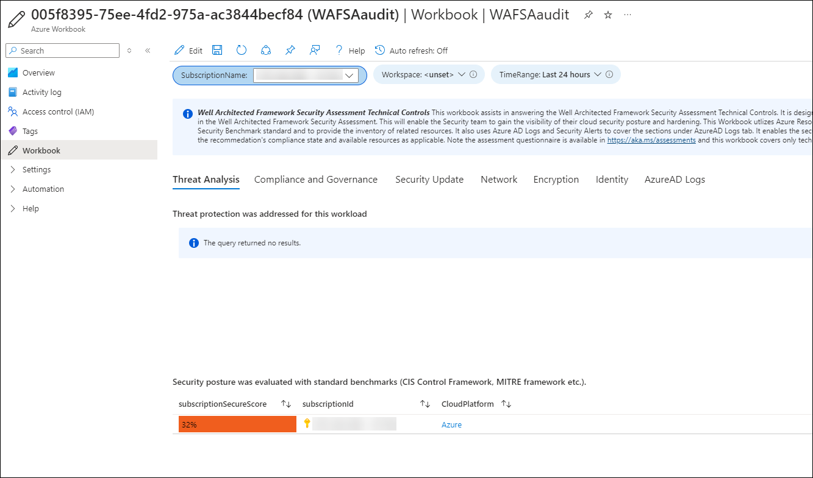

>**Note**: You can repeat this process to deploy additional Workbooks from the community repository or any that you have created.

## Validation

   > **Congratulations** on completing the task! Now, it's time to validate it. Here are the steps:
   > - Hit the Validate button for the corresponding task. You can proceed to the next task if you receive a success message.
   > - If not, carefully read the error message and retry the step, following the instructions in the lab guide.
   > - If you need any assistance, please contact us at labs-support@spektrasystems.com. We are available 24/7 to help you out.

   <validation step="50caa03f-b05a-4972-b997-ccbd606bb35c" />

## Summary

In this lab, you have worked on Ransomware Dashboard , identified the coverage of your attack surface and deployed community workbooks.
   
### You have successfully completed the lab
