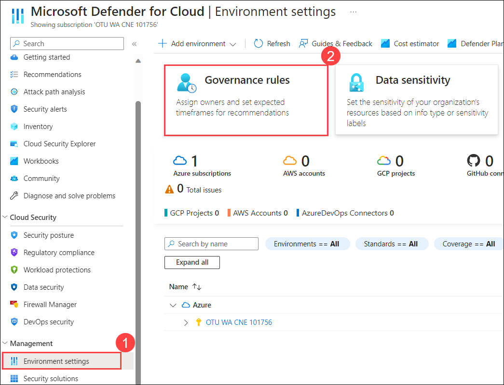
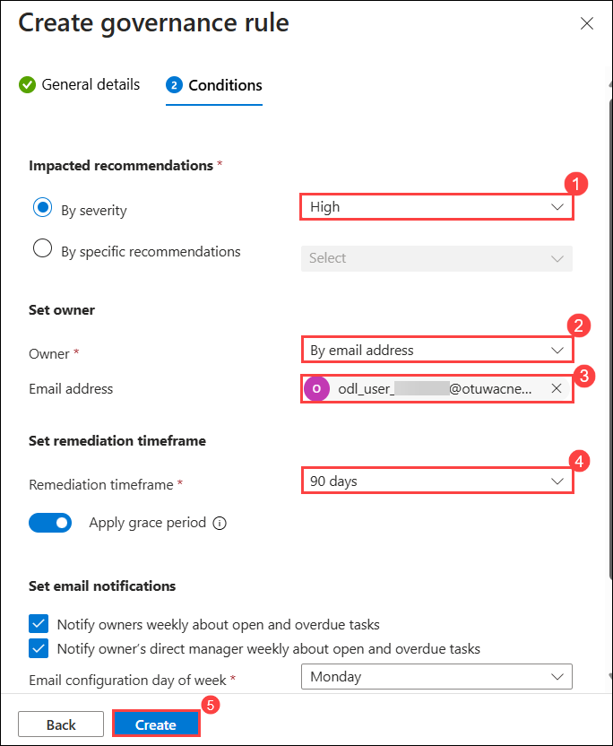

# Module E - Governance Rule

Governance rules can identify resources that require remediation according to specific recommendations or severities. Microsoft Defender for Cloud continuously assesses your hybrid and multi-cloud workloads and provides you with recommendations to harden your assets and enhance your security posture.
Central security teams often experience challenges when driving the personnel within their organizations to implement recommendations. 
The rule assigns an owner and due date to ensure the recommendations are handled. Many governance rules can apply to the same recommendations, so the rule with a lower priority value is the one that assigns the owner and due date. Governance rules will help:

- **Security teams**: Set accountability for recommendations, track their progress, and drive resource owners to action with notification capabilities.

- **Workload owners**: Focus on the specific recommendations that require their attention. They'll also be able to delegate recommendations to others or set expectations for when the recommendations will be implemented.

### Task 1: Assign Governance Rule

1. From the **Defender for Cloud** menu, click on **Environment Settings (1)** page and click on **Governance rules (2)**.

    

3. Click on **+ Create governance rule**.

    

4. Enter **Rule name** as `asclab-rule` **(1)**, select **Scope** at subscription level **(2)** and **Priority** `100` **(3)**. Click **Next (4)**.

    
    
5. Under **conditions** provide the below details and click **Create (5)**
	
   - **By severity**: `High` **(1)**
   - **Owner**: `By email address` **(2)**
   - **Email address**: <inject key="AzureAdUserEmail"></inject> **(3)**
   - **Remediation timeframe**: `90 days` **(4)**

        

6. On the **Rule created successfully** pop-up select the check box next to **Apply rule to the 42 existing recommendations that are unassigned** and click on **OK**.

    

   **Note:** You might have different pop-up wherein the existing recommendations count may vary.

8. Click on **Governance report** to view the status of tasks **Complete, Ontime and Unassign**.

    
    
    

